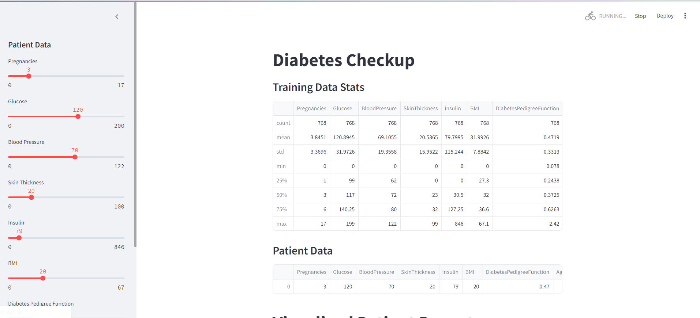
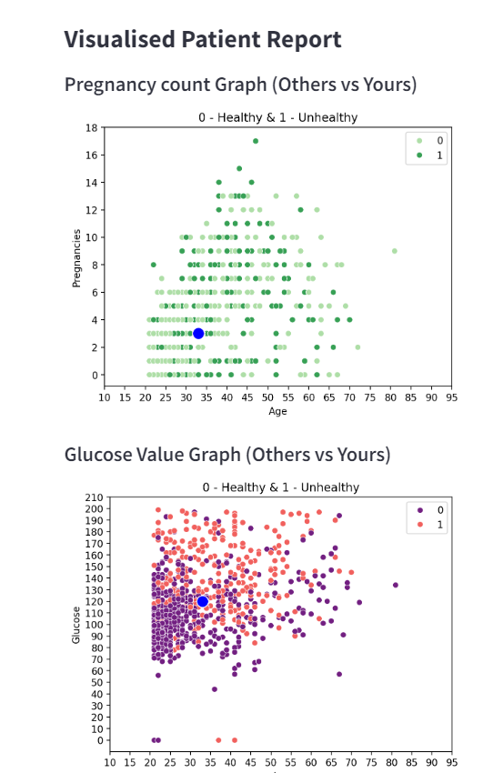
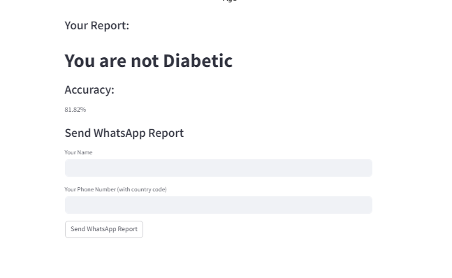

# Performance-Analysis-of-Machine-Learning-techniques-for-Prediction-of-Diabetes

## Overview

This Streamlit web app allows users to input their health data and check for diabetes risk. It uses a Random Forest classifier to predict diabetes outcomes based on user-provided data and visualizes the results with interactive plots. Additionally, users can send a WhatsApp report of their checkup results.

## Features

- **User Input:** Collects health data including pregnancies, glucose level, blood pressure, skin thickness, insulin, BMI, diabetes pedigree function, and age.
- **Prediction:** Uses a Random Forest classifier to predict diabetes risk based on the input data.
- **Visualizations:** Displays interactive graphs comparing the user's data with the general dataset.
- **WhatsApp Report:** Allows users to send a report of their checkup results via WhatsApp.

## Exploratory Data Analysis (EDA)

Exploratory Data Analysis (EDA) was performed using Jupyter Notebook. The analysis involved various machine learning models including:

- **Random Forest (RF)**
- **Decision Tree (DT)**
- **Logistic Regression (LR)**
- **Support Vector Machine (SVM)**
- **K-Nearest Neighbors (KNN)**

Different parameters were tested for each model to determine their effectiveness. The Random Forest algorithm demonstrated superior performance in terms of prediction accuracy compared to the other models. This led to the selection of Random Forest for the final implementation in the Streamlit application.

## Rationale

The Random Forest algorithm was chosen for its high accuracy in predicting diabetes risk, making it suitable for timely and effective diabetes diagnosis and management. The Streamlit-based interface supports prompt interventions and better health outcomes by providing an accessible and interactive platform for diabetes checkups.

## Preview 
1.<b>The main page</b>

<br>

2.<b>Scattered Plot</b>

<br>

3.<b>Report Page</b>

<br>


## Requirements
Create a requirements.txt file with the following content:

Copy code
streamlit
pandas
pywhatkit
scikit-learn
matplotlib
seaborn

## Installation

1. **Clone the repository:**

   ```bash
   git clone https://github.com/yourusername/diabetes-checkup-app.git
2. **Navigate to the project directory:**

   ```bash
   cd diabetes-checkup-app

3.**Install required Python packages:**

     pip install -r requirements.txt

4.**Run the Streamlit app:**

     streamlit run app.py

5.**Access the app in your web browser at:http://localhost:8501**

## How It Works
<br>
-Data Loading: The app loads a CSV file (diabetes.csv) containing the dataset used for training and testing the model.<br>
-Model Training: A Random Forest classifier is trained using the training dataset.<br>
-User Input: Users input their health data via sliders in the sidebar.<br>
-Prediction: The app predicts diabetes risk based on user input and displays results and visualizations.<br>
-Visualization: Scatter plots are used to compare the user's data with the dataset.<br>
-WhatsApp Report: Users can enter their name and phone number to receive a WhatsApp message with their checkup results.<br>

## Sending WhatsApp Reports
To use the WhatsApp messaging feature, make sure to:<br>

Install pywhatkit and configure it: Follow the installation instructions for pywhatkit.<br>
Ensure you are logged into WhatsApp Web and have a verified phone number.<br>

## Contact
For any questions or inquiries, please contact nehaannie2002@gmail.com
